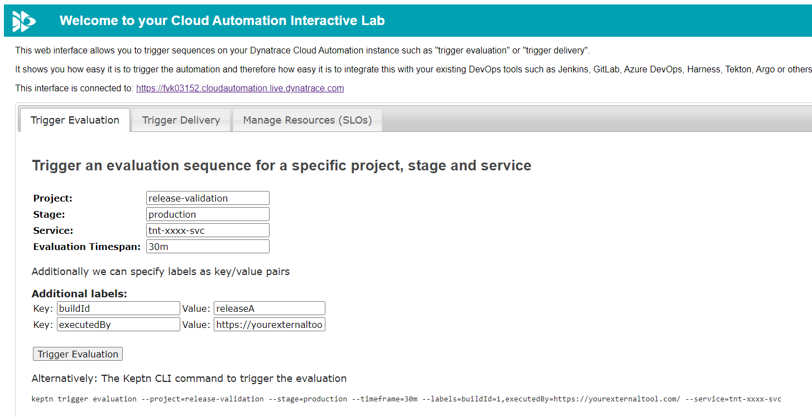
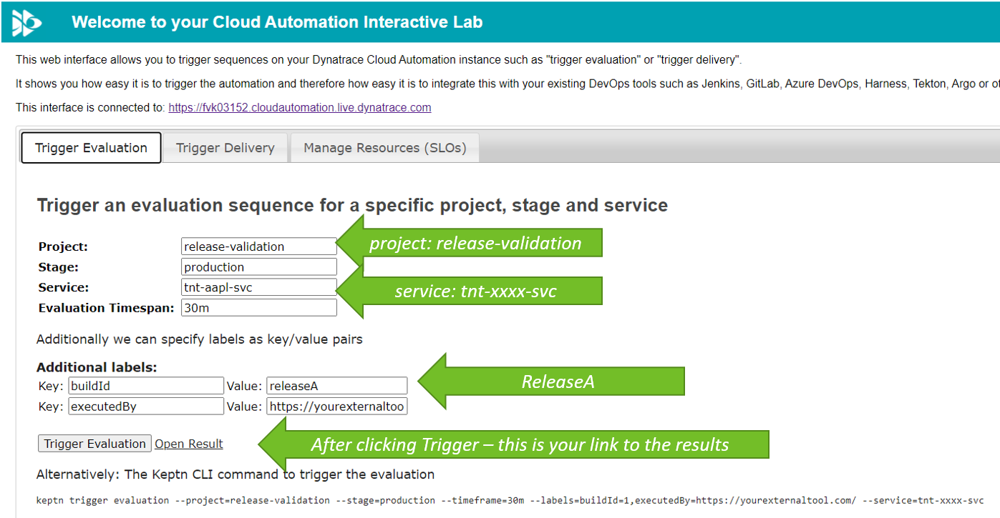
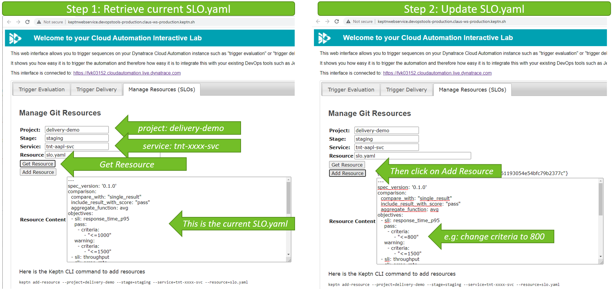
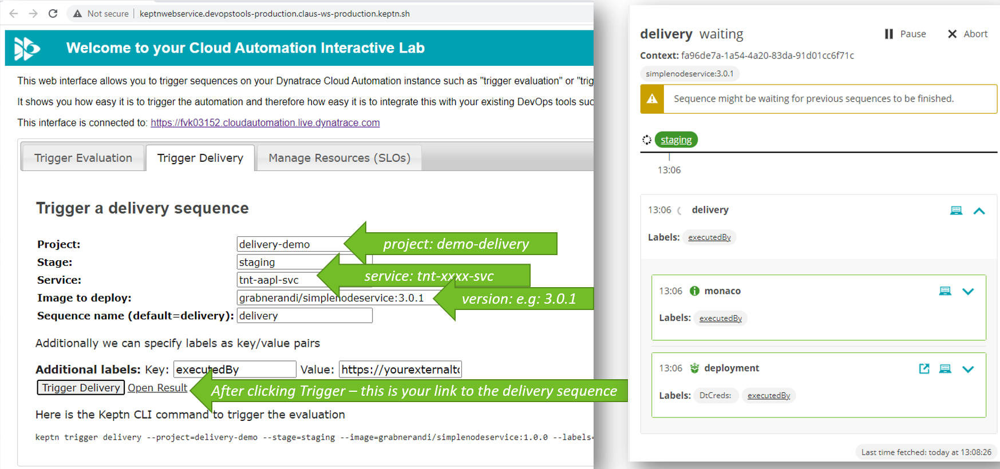

# Dynatrace Cloud Automation Workshop - Instructions for Attendees

Here is the TOC for this workshop

Overview:
1. [Our lab environment](#Access-to-the-lab-environment)
2. [Our sample app today](#Our-sample-app-today)
3. [Our simple DevOps tool](#Our-simple-DevOps-tool)

Followed by 3 labs
1. [Lab 1 - Production Reliability](#Lab-1---Production-Reliability)
2. [Lab 2 - Release Validation](#Lab-2---Release-Validation)
3. [Lab 3 - Delivery Pipelines](#Lab-3---Delivery-Pipelines)

## Access to the lab environment

### Login Credentials

Your instructor will give you login credentials to
* A Dynatrace Environment
* A Cloud Automation Environment
* A Simple DevOps Tool link

### (OPTIONAL) Install Keptn CLI locally

There are multiple ways to trigger automation. One way is through the Keptn CLI. While its not mandatory you can install it locally.
Either follow the instructions in the Cloud Automation Environment. There is a download link on the top right menu.
Or just do this on Linux, e.g: 0.10.0 CLI on your Linux:
```sh
curl -sL https://get.keptn.sh | KEPTN_VERSION=0.10.0 sudo -E bash
```

To connect to local Keptn CLI with your Cloud Automation instance copy the `keptn auth` command from the Cloud Automation UI (top right)

To validate you are connected you can run 
```
keptn status
``` 

## Pre-Lab: Lets access our sample app today

The workshop will use a very simple Node.js based sample application. Details can be found here https://github.com/grabnerandi/simplenodeservice.

### VALIDATE you can access your instance of the app

Every attendee has their own pipeline to deploy the sample app across staging and production. To differentiate our instances every attendee picked a `TenantID` from the Excel list, e.g: aapl, goog, sbux, ...
If your assigned TenantID is aapl then the service instance name is `tnt-aapl-svc`. This will also be reflected in the URL to access YOUR APP in Staging and Production:


### Background details: 4 different versions of the app available
The sample application used comes with 4 different container versions that are all uploaded to dockerhub:

| Image | Description |
| ------ | ------------- |
| grabnerandi/simplenodeservice:1.0.1 | Version 1, green background, no problems |
| grabnerandi/simplenodeservice:2.0.1 | Version 2, yellow background, high failure rate |
| grabnerandi/simplenodeservice:3.0.1 | Version 3, no problems |
| grabnerandi/simplenodeservice:4.0.1 | Version 4, only problems in production |

## Our simple DevOps tool

We will trigger automation sequences throughout our labs. Typically this is done from your existing CI/CD tools such as Jenkins, Azure DevOps, GitLab, ...
In our lab we have a very simple "DevOps CI/CD Tool" that helps us play the role of a tool that would build or deploy a new artifact and then trigger the Cloud Automation orchestration. Your instructor will show you how to access this app:



## Lab 1 - Production Reliability

The goal of this hands-on is to create 2 SLOs (Service Level Objectives) in Dynatrace
1. Availability SLO: based on Synthetic Monitoring
2. Performance SLO: % of requests faster than 500ms

Once we have those 2 SLOs we create an SLO dashboard we can use to always judge the reliability of our service as measured by our SLOs. 


### Step 1 - Create Availability SLO

As shown by the instructor simply walk through the *Add new SLO* wizard in Dynatrace. Here are the input values for your reference and for copy/pasting if those values are not pre-filled in the UI:

**Replace xxxx with your tenantID**

| Field | Value |
| ------ | ------------- |
| Metrics Expression | `builtin:synthetic.browser.availability.location.total:splitBy()`  |
| Name of SLO | `Availability of xxxx` |
| Description | `% of time xxxx service is available based on synthetic test` | 
| Entity Selector | `mzName("Tenant: tnt-xxxx-svc"),type("SYNTHETIC_TEST")` |
| Timeframe | `-1w` |

### Step 2 - Create Performance SLO

As shown by the instructor simply walk through the *Add new SLO* wizard in Dynatrace. Here are the input values for your reference and for copy/pasting if those values are not pre-filled in the UI:

**Replace xxxx with your tenantID**

| Field | Value |
| ------ | ------------- |
| Metrics Expression | `(100)*(calc:service.tenant.responsetime.count.faster500ms:splitBy())/(builtin:service.requestCount.server:splitBy())`  |
| Name of SLO | `Performance SLO of xxxx` |
| Description | `% of requests handled by xxxx service faster than 500ms` | 
| Entity Selector | `mzName("Tenant: tnt-xxxx-svc"),type("SERVICE"),tag("[Environment]DT_APPLICATION_ENVIRONMENT:production")` |
| Timeframe | `-1w` |

### Step 3 - Create SLO Dashboard

Clone the *preset* dashboard with the name `SLO Dashboard tnt-xxxx-svc`. Then modify the cloned dashboard as explained in the following screenshot!


### ALTERNATIVE LAB 1: Automation through Monaco!

**PROBABLY EXECUTED AND DEMOED BY INSTRUCTOR**
While creating SLOs and Dashboards manually is the way you typically start its not the way we can scale this.
The open source project [Monaco](https://dynatrace-oss.github.io/dynatrace-monitoring-as-code/) can be used to automatically create those two SLOs and the dashboard for us. The instructor will now do the following
1. DELETE all created SLOs and Dashboards in Dynatrace you just created :-)
2. Run the monaco script for lab 1 as [explained in section Monaco helpers for Lab 1, 2 & 3](./README.md)

## Lab 2 - Release Validation

The goal of this hands-on is to create a release validation dashboard including 
1. Our SLOs we created in Lab 1
2. Additional release health indicator metrics

and then have it automatically evaluated giving us an SLO score for a certain release validation timeframe:


### Step 1 - Clone dashboard

Clone the *preset* dashboard with the name `KQG;project=release-validation;stage=production;service=tnt-xxxx-svc` as shown here:


### Step 2 - Rename dashboard and configure your SLOs

The following screenshot shows the changes you have to make. Please ensure that
1. The name of your dashboard is `KQG;project=release-validation;stage=production;service=tnt-xxxx-svc` (replace xxxx with your tenantId)
2. Select the your Management Zone
3. Select your SLOs for your tenant


### Step 3 - Save the dashboard

That should be easy :-) -> just validate after saving that he name does not include `cloned` or `xxxx`

### ALTERNATIVE LAB 2: Automate Dashboard creation through Monaco

**PROBABLY EXECUTED AND DEMOED BY INSTRUCTOR**
Same is in Lab 1 we can automate the creation of dashboards through Monaco.
1. If students have created dashboards feel free to delete them :-)
2. Run the monaco script for lab 2 as [explained in section Monaco helpers for Lab 1, 2 & 3](./README.md)

### Step 4a - Trigger evaluations for your service via the Cloud Automation 

There are different ways we can trigger an evaluation. Typically it would be done through your existing release or deployment tool, e.g: Jenkins, GitLab, Azure DevOps ... We can use the Simple DevOps tool that comes with our lab environment to trigger an evaluation



**Trigger more evaluations**
Trigger multiple evaluations and 
- play around with different timeframes
- edit the dashboard, e.g: change pass & warning settings or add/remove charts
- change the label for every run, e.g: `releaseB`, `releaseC` ...

Watch the result of the evaluation in the cloud automation web ui!

### Step 4b - Trigger an evaluation for your service via Keptn CLI

Here is the first alternative to the simple DevOps tools: Keptn CLI

If you have access to the Keptn CLI (via Bastion host or installed locally) you can execute the following command (replace xxxx with your tenantId) which will:
1. Trigger an evaluation against your dashboard
2. Will evaluate the last 30 minutes
3. Will add the label `releaseA`

```
keptn trigger evaluation --project=release-validation --stage=production --service=tnt-xxxx-svc --timeframe=30m --labels=buildId=releaseA
```

Watch the result of the evaluation in the cloud automation web ui!

**Trigger more evaluations**
Trigger multiple evaluations and 
- play around with different timeframes
- edit the dashboard, e.g: change pass & warning settings or add/remove charts
- change the label for every run, e.g: `releaseB`, `releaseC` ...

Watch the result of the evaluation in the cloud automation web ui!

### Step 4c - Trigger evaluation via Keptn API

Besides using the Keptn CLI to trigger an evaluation we can also trigger it via the Keptn API. An easy way to do it is via the Swagger Web UI.
1. In the Cloud Automation UI first copy the API Token (via the menu on the top right)
2. Open the API UI (via menu in the top right)
3. Switch to the 'controlPlane` API definition
4. Authenticate the UI using the token you have in your clipboard (from point 1)
5. Scroll to the /evaluation API definition
6. Fill out the form like this -> replace xxxx with your tenant

| Field | Value |
| ------ | ------------- |
| project | `release-validation`  |
| stage | `production` |
| service | `tnt-xxxx-svc` |
| Evaluation | 
```
{
  "labels": {
    "executedBy": "api",
    "buildId": "releaseC"
  },
  "timeframe": "30m"
}
```

Watch the result of the evaluation in the cloud automation web ui!

## Lab 3 - Delivery Pipelines

The goal of this hands-on is to shift-left release validation based on SLOs into the delivery pipeline and use the SLO Scoring of important metrics as automated Quality Gates. While we could use a dashboard approach we now want to use the "As Code" approach via .YAML files. This is an approach that is closer to how developers - who we want to encourage to use this capability - like to define their configuration!


### Step 1 - Explore previous runs

In the Cloud Automation UI explore the delivery-demo project. Find your service and check out the latest evaluation. You will see the heatmap. Then click on SLO to see the slo.yaml definition that was used for the deployment that was done in preparation of this lab!

### Step 2 - Edit current SLO.yaml

In a real setup we would either have the cloud automation project setup with an upstream git repository and change files there. Or - we would have a git repository with the configuration files that would be pushed to cloud automation before triggering a delivery.
To make things easy our Simple DevOps tools provides an option to load the current configuration files, modify them and upload the change.



### Step 3a - Trigger a deployment sequence for your service

Lets now trigger a delivery of a different version of our sample app. As part of the delivery SLIs and SLOs as defined in code (via yaml) will be used for the evaluation.

We can start with delivering version 2.0.1 of the app



**Trigger more**
Once done and if time allows trigger the delivery of versions 3.0.1 or 4.0.1

### Step 3b - Trigger a deployment sequence for your service via Keptn CLI

If you have access to the Keptn CLI (via Bastion host or installed locally) you can execute the following command (replace xxxx with your tenantId) which will **trigger** a **delivery** sequence to deliver version 2.0.1 for your service

```
$ keptn trigger delivery --project=delivery-demo --service=tnt-xxxx-svc --image=grabnerandi/simplenodeservice:2.0.1
```

Watch the deployment sequence in the cloud automation web ui!

**Trigger more**
Once done and if time allows trigger the delivery of versions 3.0.1 or 4.0.1

### Step 3c - Trigger deployment via Keptn API

Besides using the Keptn CLI to trigger a deployment we can also trigger it via the Keptn API. An easy way to do it is via the Swagger Web UI.
1. In the Cloud Automation UI first copy the API Token (via the menu on the top right)
2. Open the API UI (via menu in the top right)
3. Switch to the 'api-service` API definition
4. Authenticate the UI using the token you have in your clipboard (from point 1)
5. Scroll to the /event API definition
6. Use the following payload -> replace xxxx with your tenant
```
{
  "data": {
    "configurationChange": {
      "values": {
        "image": "grabnerandi/simplenodeservice:3.0.1"
      }
    },
    "project": "delivery-demo",
    "service": "tnt-xxxx-svc",
    "stage": "staging"
  },
  "source": "https://github.com/keptn-sandbox/keptn-on-k3s/cloudautomation",
  "specversion": "1.0",
  "type": "sh.keptn.event.staging.delivery.triggered",
  "shkeptnspecversion": "0.2.3"
}
```

Watch the deployment sequence in the cloud automation web ui!