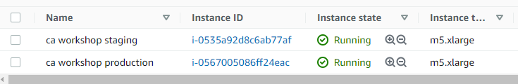
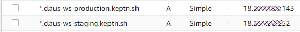
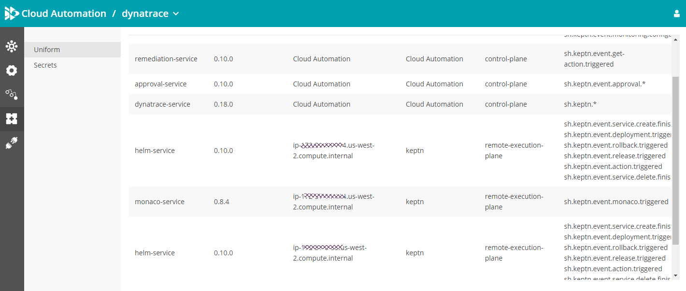
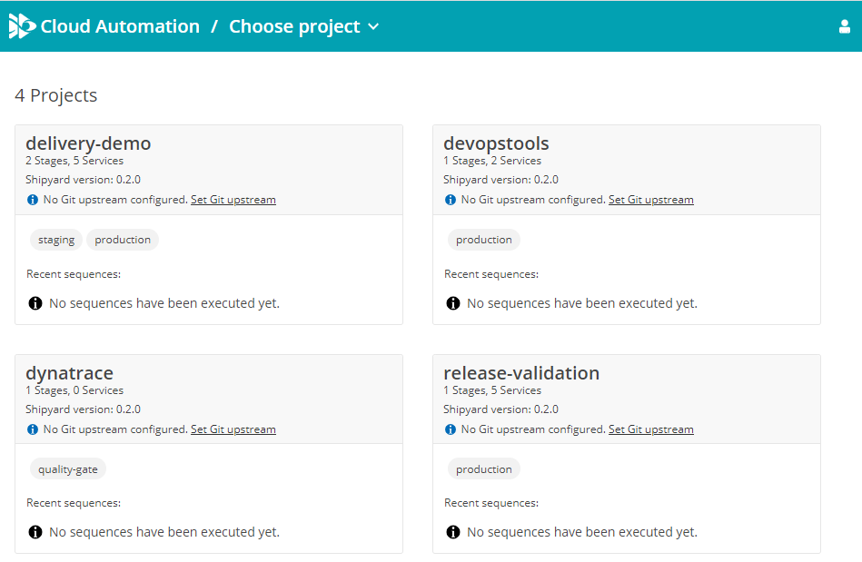

# Dynatrace Cloud Automation Workshop - Instructions for Trainers

This folder contains scripts to setup a Dynatrace Cloud Automation Workshop

It's assumed you have the following:
1. *A Dynatrace Environment* (SaaS or Managed with exposed API)
   
   **CAUTION:** As we are heavily using Dynatrace Synthetics make sure you are not limited on Synthetics because you e.g: use a Trial Account! If you need more synthetics reach out internally to extend the number of synthetics
2. *A Cloud Automation SaaS Environment* (aka Keptn SaaS Control Plane)

   **CAUTION:** Make sure to request a Cloud Automation instance ahead of time by requesting it through BAS. If you have questions use our internal slack channel #help-cloud-automation-solution

3. *ONE or TWO EC2 Amazon Linux instance*

   **INFO:** The instructions give you two options. Either a single larger EC2 machine or two smaller EC2 machines. Those EC2s will run your target system execution plane system (staging, production).

4. A gmail or equivalent email for workshop attendees

   **INFO:** To make it easier for people to sign into Dynatrace and Cloud Automation tenants I suggest to create e.g: gmail account and invite this account to your Dynatrace and Cloud Automation instance. With this its easy for every attendee to login with the same user.

5. An online spreadsheet (Excel, Google, ...) to keep track of progress

   **INFO:** You can create a copy of the [Excel Template](./WorkshopHandsOnFEEDBACK.xlsx). Then put it on a shared drive and create a link. You can then share this link with the attendees. The link is also used in a setup step further down the readme.

What you need is:
1. **DT_TENANT**: hostname of your SaaS or managed environment, e.g: abc12345.live.dynatrace.com
2. **DT_API_TOKEN**: It needs several privileges. Check out [this screenshot](./images/setup_dtapitokens.png) for all details!
3. **DT_PAAS_TOKEN**: A PAAS Token as the script also installs a OneAgent & ActiveGate on your Bastion Host
4. **KEPTN_CONTROL_PLANE_DOMAIN**: hostname of your Cloud Automation enviornment, e.g: abc12345.cloudautomation.live.dynatrace.com
5. **KEPTN_CONTROL_PLANE_API_TOKEN**: API Token for your Cloud Automation environment
6. **OWNER_EMAIL**: The username (=email) of your Dynatrace user. It will be used to create dashboards in your tenant. SUGGESTION: use the gmail as explained in Step 4 above

Optionally:
1. **SYNTHETIC_LOCATION**: Synthetic tests will be created through Monaco. The default location is GEOLOCATION-45AB48D9D6925ECC (AWS Frankfurt). Double check that you have this location available, e.g: Dynatrace Sprint tenants would have a different location. Specify your location via this environment variable 

## Installing the workshop

### Creating Execution Plane instances

Here the overview of configurations we have tested:
1. Single machine: m5.8xlarge, 30GB Storage
2. Two machines: m5.xlarge, 30GB Storage
On those machines allow incoming SSH, HTTP & HTTPS traffic

Here a screenshot of my AWS Console showing my two EC2 instances:


What you will need later on is the public IP of those execution planes. 

An *alternative* to using the IPs is to create e.g: a Route53 wildcard entry to get a nice Domain name for your execution plane. 
Here two suggestions if you go down this route:
1. claus-ws.yourdomain -> pointing to the IP of your single machine
2. claus-ws-staging.yourdomain -> pointing to one of your machine; claus-ws-production.yourdomain -> pointing to the other machine

Here is a screenshot on those wildcard routes in Route53:



### Required tools on EC2 execution plane machine(s)!

On each of those machines we need a couple of tools first. Do this:
```console
sudo yum update -y
sudo yum install git -y
sudo yum install curl -y
sudo yum install jq -y
sudo yum install tree -y
sudo wget https://github.com/mikefarah/yq/releases/download/3.4.1/yq_linux_amd64 -O /usr/bin/yq && sudo chmod +x /usr/bin/yq
```

### Step 1: Export Environment Variables

Logon to your EC2 Amazon Linux instance and execute the following:

```bash
export DT_TENANT=abc12345.live.dynatrace.com
export DT_API_TOKEN=dt0c01.XXXXXXXXXXXXXXXXXXXXXXXXXXXXXXX
export DT_PAAS_TOKEN=dt0c01.YYYYYYYYYYYYYYYYYYYYYYYYYYYYYYYYYY

export KEPTN_CONTROL_PLANE_DOMAIN=abc12345.cloudautomation.live.dynatrace.com
export KEPTN_CONTROL_PLANE_API_TOKEN=ZZZZZZZZZZZZZZZZZZZZZZZZZZZZZZZZZZZZZZZZZZZ

export OWNER_EMAIL=youremail@domain.com

export ISTIO=false

# export SYNTHETIC_LOCATION=GEOLOCATION-45AB48D9D6925ECC 
```

### Step 2: Clone the git repo

Now its time to clone this git repo
```bash
git clone https://github.com/keptn-sandbox/keptn-on-k3s
cd keptn-on-k3s
git checkout release-0.10.0
```

### Step 3: Install Execution Plane

Whether you install a single or two execution planes (one for staging and prod) - afterwards you can validate if the installation worked correctly by looking at your Uniform screen in your Cloud Automation instance. you should see the Helm and Monaco service show up in the list:



### Step 3a: Install a single k3s Execution Plane for Production & Staging

**This installation option is good if you don't have too many tenants in your workshop and if your k3s host has sufficient CPU and Memory**

Now its time to run the installation script!
```bash
export KEPTN_EXECUTION_PLANE_STAGE_FILTER=
export KEPTN_EXECUTION_PLANE_SERVICE_FILTER=
export KEPTN_EXECUTION_PLANE_PROJECT_FILTER=
```

To install by just using the public IP of your linux machine you can use the option --use-nip in the end which will then use nip.io to create a "fake" DNS Entry for your IP.
```bash
./install-keptn-on-k3s.sh --executionplane --provider aws --with-genericexec --with-monaco --use-nip
```

If you have your own DNS entry such as claus-ws.yourdomain then you can use the --fqdn
```bash
./install-keptn-on-k3s.sh --executionplane --provider aws --with-genericexec --with-monaco --fqdn claus-ws.yourdomain
```

### Step 3b: Install a two k3s Execution Planes. One for Production & one for Staging

**This requires two smaller hosts as each host is only handling either production or staging traffic**

We first install the Execution Plane targeted for Production (here we also install Gitea)
```bash
export KEPTN_EXECUTION_PLANE_STAGE_FILTER=production
export KEPTN_EXECUTION_PLANE_SERVICE_FILTER=
export KEPTN_EXECUTION_PLANE_PROJECT_FILTER=
./install-keptn-on-k3s.sh --executionplane --provider aws --with-genericexec --with-monaco --use-nip
```

And now the Execution Plane targeted for Staging (no need for gitea)
```bash
export KEPTN_EXECUTION_PLANE_STAGE_FILTER=staging
export KEPTN_EXECUTION_PLANE_SERVICE_FILTER=
export KEPTN_EXECUTION_PLANE_PROJECT_FILTER=
./install-keptn-on-k3s.sh --executionplane --provider aws --with-genericexec --with-monaco --use-nip
```

**ALTERNATIVE FOR DNS**: similar as explained in Step 3a you can use --fqdn instead of --use-nip in case you have created a DNS entry for both your staging and production machine, e.g: `--fqdn claus-ws-staging.yourdomain` and `--fqdn claus-ws-production.yourdomain`

### Step 4: Install demo projects

After you are done with this step you should see the following projects in your Cloud Automation instance:


There are three additional projects being created when executing `./install-cloudautomation-workshop.sh`
1. *delivery-demo*: two stage delivery of the simplenode app
2. *release-validation*: a simple quality gate project to demo automating release validation
3. *devopstools*: a simple project to deploy some helper DevOps tools, e.g: "Sample CI/CD Web Interface" to trigger keptn sequences

Here some more information!
The core demo project is called `delivery-demo`. It is a two stage delivery pipeline of services with the name pattern tnt-TENANTID-svc.
The idea is that every attendee of the workshop gets its own service. The story is that we are all working for a SaaS provider and we are all responsible for our individual tenants.

In order to create tenants for each student we need to create a file called `tenants.sh` in the `cloudautomation/scripts` folder that sets the TENANTID into an array as described here. The tenant IDs must only contain alphanumeric characters and have to be lowercase. Here is an example for 3 tenants:

**./cloudautomation/scripts/tenants.sh:**
```sh
INSTANCE_ARRAY=(aapl acer amzn)
```

**TIP for Workshops:** To come up with the list of tenants a suggestion is to use the first two characters of your attendees first and last names for the tenant IDs, e.g: Andreas Grabner would be angr, Henrik Rexed would be here, ... 
Another option would be to use e.g: stock symbols. With this you can assign everyone a stock symbol that is easy to remember, e.g: aapl, acer, amzn, ... There is a sample file called `tenants.stocksample.sh`. It contains 30 symbol names (some made up) :-)

**IMPORTANT:** Dynatrace automatically detects "version information" in pod names by removing hexadecimal patterns. So - make sure that these tenantIDs do not include numbers or just letters from A to F


Now we are ready and can create the demo project for that workshop
```bash
cd cloudautomation/scripts
export OWNER_EMAIL=youremail@domain.com

export KEPTN_CONTROL_PLANE_DOMAIN=abc12345.cloudautomation.live.dynatrace.com
export KEPTN_CONTROL_PLANE_API_TOKEN=ZZZZZZZZZZZZZZZZZZZZZZZZZZZZZZZZZZZZZZZZZZZ

export KEPTN_EXECUTION_PLANE_INGRESS_DOMAIN=your.productionk3s.i.p.nip.io   (this is the production execution plane IP)
export KEPTN_PRODUCTION_INGRESS=your.productionk3s.i.p.nip.io
export KEPTN_STAGING_INGRESS=your.stagingk3s.i.p.nip.io

./install-cloudautomation-workshop.sh
```

## Step 5: Initial Dynatrace Setup Configuration

**REQUIRES YOU TO ALSO INSTALL MONACO**. Install from [here](https://dynatrace-oss.github.io/dynatrace-monitoring-as-code/installation)
Or - try these commands:
```
curl -L https://github.com/dynatrace-oss/dynatrace-monitoring-as-code/releases/download/v1.6.0/monaco-linux-amd64 -o monaco
chmod +x monaco
sudo mv monaco /usr/local/bin/
```

While the delivery-demo project contains monaco to automatically create naming and tagging rules there is a [monaco](./monaco) project you can execute on its own which will
* Create auto-tagging rules
* Create Naming rules
* Create default template dashboards
* Creates an overview dashboard with links to additional material, login details, online excel ...

Here is how to run that monaco project
```bash
cd cloudautomation/monaco
export OWNER_EMAIL=youremail@domain.com
export DT_TENANT=abc12345.live.dynatrace.com
export DT_API_TOKEN=dt0c01.XXXXXXXXXXXXXXXXXXXXXXXXXXXXXXXX.YYYYYYYYYYYYYYYYYYYYYYYYYYYYYYYYYYYYYYYYY
export KEPTN_CONTROL_PLANE_DOMAIN=abc12345.cloudautomation.live.dynatrace.com
export KEPTN_PRODUCTION_INGRESS=your.productionk3s.i.p.nip.io
export KEPTN_STAGING_INGRESS=your.stagingk3s.i.p.nip.io
export WORKSHOP_USERNAME=usernameForWorkshopattendees
export WORKSHOP_PASSWORD=pwdForWorkshopattendees
export ONLINE_SPREADSHEET=https://YOURLINKTOANONLINESPREADSHEET

monaco -e environment.yaml projects/setup
```

## Step 6: Deploy supporting "DevOps tools", e.g: Keptn Web Service App

The cloud automation workshop sample installation creates a project called devopstools. 
This project currently contains a very simply web app that allows you to trigger evaluations or delivery sequences without the need to use a keptn CLI. We introduced this as many attendees have restrictions in downloading the CLI or accessing the bastion host. The story is that this "devops tool" could be your Jenkins, GitLab, Azure DevOps ... from where you can trigger your automation.

To trigger the deployment of this app you have to do this once:
```
keptn trigger delivery --project=devopstools --service=keptnwebservice --image=grabnerandi/keptnwebservice:2.0.0
```

## Executing some samples for the workshop

### Step 1: Deploy services end-2-end

```
keptn trigger delivery --project=delivery-demo --service=tnt-aapl-svc --image=grabnerandi/simplenodeservice:1.0.1
```

### Step 2: Deploy services directly in production

```
keptn trigger delivery --project=delivery-demo --service=tnt-aapl-svc --stage=production --image=grabnerandi/simplenodeservice:1.0.1
```

### Step 3: Deploy ALL services for ALL tenants in one go

There is a helper script that iterates over the list of workshop tenants and executes a `keptn trigger delivery`. This script by default waits 20 seconds between the trigger calls to ensure we are not overloading your cloud automation environment with too many deployments at the same time.

```
Deploy staging and then production:
./trigger-for-all-tenants.sh tenants.sh delivery-demo staging grabnerandi/simplenodeservice:1.0.1
```

```
Deploy straight into production (will prompt for approval in UI):
./trigger-for-all-tenants.sh tenants.sh delivery-demo production grabnerandi/simplenodeservice:1.0.1
```

## Monaco helpers for Lab 1, 2 & 3

The workshop walks our attendees through the manual creation of SLOs and Dashboards. For each lab we also have monaco projects where we can automatically create all configurations for that lab. This is a great way to show how Monaco can help us automate configuration.

One thing I suggest to do is e.g: let attendees manually walk through the creation of the SLOs. Then DELETE all SLOs that they have just created and show them how to automatically create those SLOs through monaco. There is a helper script that triggers monaco for every of your workshop tenants:

```
For lab1:
./monaco-for-all-tenants.sh tenants.sh lab1
```

```
For la2:
./monaco-for-all-tenants.sh tenants.sh lab2
```

```
For lab3: 
./monaco-for-all-tenants.sh tenants.sh lab3
```

To delete configuration simply do this:
```
./monaco-for-all-tenants.sh tenants.sh delete
```

## Import Sample Dynatrace SLO Dashboard

If you ran the setup monaco script as explained in Step 4 you are all good. If not - you can also import the default dashboards as explained here
You can either

### SLO Quality Gate Dashboard
In this directory you find the [default_qualitygate_dashboard.json](./scripts/default_qualitygate_dashboard.json). 
I suggest you import this one to your Dynatrace environment as you can use it as a template for the SLO-based Quality Gate tutorial.
The name can be: `KQG;project=dynatrace;stage=quality-gate;service=<YOURSERVICENAME>`

### SLO Dashboard
In this directory you also find the [default_slo_dashboard.json](./scripts/default_slo_dashboard.json). 
I suggest you import this one to your Dynatrace environment as you can use it as a template for the SLO-based Quality Gate tutorial.
The name can be: `SLO Dashboard for tenant xxxx`


## Cleanup and Troubleshooting

### Troubleshooting failed installation

If the installation of a keptn execution plane fails, e.g: something during ./install-keptn-on-k3s.sh then the best is to first execute: `k3s-uninstall.sh`
This will uninstall k3s which is required before you fix the issue and run install-keptn-on-k3s.sh again.

### Cleanup Keptn projects after workshop

To delete the projects simply do this:
```
keptn delete project delivery-demo
keptn delete project release-validation
keptn delete project devopstools
```

### Delete control plane

Simply execute `k3s-uninstall.sh`
That will remove k3s from your machine!